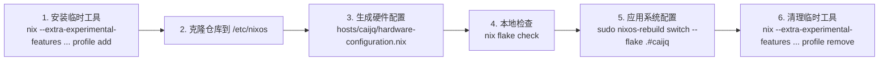

# NixOS VPS 配置（Flake + Home Manager）

[](https://nixos.org)
[](https://nixos.wiki/wiki/Flakes)
[](https://github.com/nix-community/home-manager)
[](https://github.com/caijq00/nixos-vps)
[](https://github.com/caijq00/nixos-vps/commits/main)

参考 [ryan4yin/nix-config](https://github.com/ryan4yin/nix-config) 的思路，使用简单、清晰的 `hosts + modules + home` 结构。

## 目录结构

```text
nixos-vps/
├── flake.nix
├── hosts/
│   └── caijq/
│       ├── default.nix
│       ├── hardware-configuration.nix
│       ├── users.nix
│       └── security.nix
├── modules/
│   └── nixos/
│       ├── base.nix
│       ├── shell.nix
│       └── docker.nix
├── home/
│   └── default.nix
├── configuration.nix            # 兼容入口（shim）
├── hardware-configuration.nix   # 兼容入口（shim）
└── home.nix                     # 兼容入口（shim）
```

## 在 VPS 上使用这个配置

说明：当前这套 NixOS 配置完成后，系统会安装并启用以下主要内容：

- 基础工具：`vim` `git` `curl` `wget` `tmux` `htop` `jq` `ripgrep` `fd` `bat` `eza`
- 运维工具：`lsof` `strace` `iotop-c` `iftop` `sysstat` `ethtool` `nix-tree` `nix-output-monitor`
- 开发运行时：`python3` `uv` `rustc` `cargo` `rust-analyzer` `gcc` `pkg-config` `cmake` `openssl` `zlib` `volta` `bun`
- AI CLI：`claude` `qwen`（由 `bun` 全局安装并通过系统 wrapper 暴露命令）
- 系统服务：`nginx`（默认监听 80，返回 `nginx is running`）

安装步骤



### 手动挡

1. 如果是刚装好的 NixOS、工具还不全，先临时安装常用工具（不影响 `nixos-rebuild`）：

说明：这里使用 `nix --extra-experimental-features 'nix-command flakes' profile add`，
是为了在“还没把 flakes 配置持久化到系统”时也能直接执行，避免新装系统上 `nix profile` 子命令不可用或行为不一致。

```bash
nix --extra-experimental-features 'nix-command flakes' profile add nixpkgs#curl nixpkgs#git nixpkgs#tmux
```

2. 克隆仓库到 VPS（`/etc/nixos`）：

```bash
cd /etc/nixos
sudo git clone https://github.com/caijq00/nixos-vps
```

3. 在 VPS 上生成硬件配置,在/etc/nixos/nixos-vps 目录：

说明：这一步会根据当前 VPS 的磁盘/文件系统/引导设备生成硬件配置，
并写入 `hosts/caijq/hardware-configuration.nix`。在仓库目录执行是为了确保写入到当前 flake 使用的主机配置文件，避免写到错误路径。

```bash
cd /etc/nixos/nixos-vps
sudo nixos-generate-config --show-hardware-config \
  | sudo tee hosts/caijq/hardware-configuration.nix > /dev/null
```

生成配置后，如果需要排除国内镜像缺包问题，可先用“清华源优先、官方兜底”做一次构建验证：

```bash
sudo nix --extra-experimental-features "nix-command flakes" build \
  .#nixosConfigurations.caijq.config.system.build.toplevel \
  --no-link -L \
  --option max-jobs 1 \
  --option cores 1 \
  --option fallback false \
  --option substituters "https://mirrors.tuna.tsinghua.edu.cn/nix-channels/store https://cache.nixos.org/"
```

4. 本地检查：

```bash
nix flake check
```

5. 在 VPS 直接应用：

```bash
sudo nixos-rebuild switch --flake .#caijq
```

6. 首次 `rebuild` 成功后，删除上面临时用 `nix profile` 安装的工具，避免和系统声明式配置重复：

```bash
nix --extra-experimental-features 'nix-command flakes' profile remove nixpkgs#curl nixpkgs#git nixpkgs#tmux
```

可选建议（2G VPS）：如果内存较小或构建时容易 OOM，可先补一个 4G swap。

先确认当前内存与 swap：

```bash
free -h
swapon --show
```

如果 swap 太小（例如 DD 后只有 150Mi），可临时增加 4G swap（立即生效）：

```bash
sudo rm -f /swapfile
sudo mkdir -p /var/lib
sudo fallocate -l 4G /var/lib/swapfile
sudo chmod 600 /var/lib/swapfile
sudo mkswap /var/lib/swapfile
sudo swapon /var/lib/swapfile
swapon --show
free -h
```

如果 `sudo rm -f /swapfile` 提示 `Operation not permitted`，常见是两种情况：

1. `/swapfile` 仍在使用中
2. 文件被设置了 immutable 属性（`chattr +i`）

可按下面顺序处理：

```bash
sudo swapoff /swapfile || sudo swapoff -a
sudo lsattr /swapfile 2>/dev/null || true
sudo chattr -i /swapfile 2>/dev/null || true
sudo rm -f /swapfile
```

## 新用户替换（例如 `caijq` -> `ccc`）

本仓库已改为“单点变量”结构。默认用户名和主机名集中在 `flake.nix`：

```nix
hostDir = "caijq";
hostName = "caijq";
username = "caijq";
```

新用户只需要修改 `username`（以及按需修改 `hostName`），不再建议全仓库批量替换文本。
如果修改了 `hostName`，记得把命令中的 `.#caijq` 同步替换成新的主机名。

## 安全与默认值

- SSH 端口为 `9527`，防火墙默认开放：`9527 80 443`。
- root 禁止 SSH 登录（`PermitRootLogin = no`）。
- 仅允许 `username` 对应用户通过 SSH 登录（`AllowUsers = [ username ]`）。
- `users.users.${username}.initialPassword = "change-me"` 仅用于初始化，请部署后立即修改。
- sudo 配置：主用户（`username`）执行 sudo 无需密码，wheel 组其他用户需要密码。
- Nix 二进制缓存优先级：`https://cache.nixos.org`（官方）> `https://nix-community.cachix.org` > 国内镜像（中科大、清华）。
- `nixpkgs` 和 `home-manager` 的 flake 输入使用 GitHub 官方源。中国大陆用户如需使用清华镜像，可参考 `flake.nix` 中的注释说明。

## 日常操作

- 更新系统：

```bash
sudo nixos-rebuild switch --flake .#caijq
```

- 查看可用主机：

```bash
nix flake show
```

- 查看系统历史版本（generations）：

```bash
sudo nix-env -p /nix/var/nix/profiles/system --list-generations
```

- 临时回滚到上一代（立即切换）：

```bash
sudo nixos-rebuild switch --rollback
```

- 回滚到指定 generation（例如 123）：

```bash
sudo /nix/var/nix/profiles/system-123-link/bin/switch-to-configuration switch
```

- 将指定 generation 设为下次开机默认（例如 123）：

```bash
sudo nix-env -p /nix/var/nix/profiles/system --switch-generation 123
```

- 清除所有旧版本（删除旧 generations，仅保留当前）：

```bash
sudo nix-collect-garbage -d
```

## 2G 内存 VPS 建议

- 本仓库已在 `modules/nixos/base.nix` 里完全禁止本地编译：`max-jobs = 0`、`cores = 1`。
- 已设置 `fallback = false`：如果缓存没有命中会直接失败，避免 VPS 源码编译导致卡死。
- 已配置 zram + 4G swapfile，降低内存峰值时 OOM 风险。
- **注意**: `max-jobs = 0` 会禁止任何本地构建。如果 `nixos-rebuild` 报错 `Unable to start any build`，说明有包缺少缓存，可临时改为 `max-jobs = 1` 或切换到官方源重试。

排障命令（在 VPS 上执行）：

```bash
free -h
swapon --show
journalctl -k -b | rg -i "oom|killed process|out of memory"
```

如果 `nixos-rebuild` 报某个 derivation 需要本地 build，可先单独确认是否有缓存：

```bash
nix build .#nixosConfigurations.caijq.config.system.build.toplevel --no-link -L
```

若系统当前还没吃到这些配置，可先用一次性低内存参数执行：

```bash
sudo nixos-rebuild switch --flake /etc/nixos/nixos-vps#caijq -L \
  --option max-jobs 1 \
  --option cores 1 \
  --option fallback false
```

### 构建策略与缓存命令

1. 低线程构建（推荐日常使用）

```bash
sudo nixos-rebuild switch --flake /etc/nixos/nixos-vps#caijq -L \
  --option max-jobs 1 \
  --option cores 1 \
  --option fallback false
```

2. 严格禁止本地编译（用于诊断缓存是否命中）

```bash
sudo nix --extra-experimental-features "nix-command flakes" build \
  .#nixosConfigurations.caijq.config.system.build.toplevel \
  --no-link -L \
  --option max-jobs 0 \
  --option fallback false
```

说明：`max-jobs = 0` 会禁止任何本地 build。若直接报 `Unable to start any build`，说明当前目标存在本地组装步骤；此时用 `max-jobs = 1` 继续，并保持 `fallback = false` 防止回退源码编译大包。

3. 固定依赖版本（提升缓存命中稳定性）

```bash
cd /etc/nixos/nixos-vps
sudo nix --extra-experimental-features "nix-command flakes" flake lock
git add flake.lock
git commit -m "chore: lock flake inputs"
```

4. 查看当前生效的 Nix 配置

```bash
grep -E "max-jobs|cores|fallback|substituters" /etc/nix/nix.conf
sudo nix config show | rg -n "max-jobs|cores|fallback|substituters"
```

## 已知问题

⚠️ 自动脚本目前有 bug，暂不建议使用：


### 自动挡

```bash
~~`curl -fsSL https://raw.githubusercontent.com/caijq00/nixos-vps/main/scripts/nixos-vps-auto.sh | bash`~~
```

说明：脚本会先配置 swap，然后生成/更新硬件配置（已存在时会询问是否覆盖并自动备份），最后执行 `nixos-rebuild`：可选择低内存参数模式，或标准模式。已兼容 `curl | bash` 方式下的交互输入。
若 `/etc/nixos/nixos-vps` 已存在，脚本会跳过克隆直接继续执行。
脚本会自动检测主机目录与 `flake.nix` 配置的一致性，并在结束时汇总显示 SSH 端口、登录用户、初始密码提醒，并提示你在 rebuild 后重启系统。
脚本提供两个交互选项：
1. 是否使用低内存参数（`max-jobs 1, cores 1, fallback false`）
2. 是否强制只使用官方缓存（`--option substituters https://cache.nixos.org`），跳过国内镜像，适用于排查缓存缺包问题

## 鸣谢

感谢 `nyan4yin` 提供的参考。
